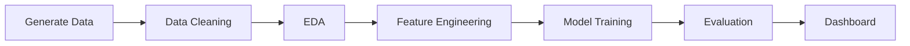

 <div align="center">

<!--  --> 


# 🛒✨ E-Commerce Customer Behavior Analysis & Churn Prediction


### 🎯 _Predict Customer Churn • Maximize Retention • Drive Revenue Growth_

<p align="center">
  <a href="#-key-features">Features</a> •
  <a href="#-quick-start">Quick Start</a> •
  <a href="#-project-architecture">Architecture</a> •
  <a href="#-methodology">Methodology</a> •
  <a href="#-tech-stack">Tech Stack</a> •
  <a href="#-results">Results</a> •
  <a href="#-dashboard">Dashboard</a>
</p>

---

### 📊 Project Highlights

```
🎯 Churn Prediction Accuracy: 85%+     💰 Revenue Impact: High-Value Customer Identification
📈 Customer Segmentation: RFM Analysis  🔮 Real-Time Predictions: Streamlit Dashboard
⚡ End-to-End ML Pipeline: Production Ready
```

</div>

---


## 🌟 Overview


> **Transform raw customer data into actionable business insights with cutting-edge machine learning**

This comprehensive ML project analyzes e-commerce customer behavior patterns to predict churn, segment customers, and optimize retention strategies. Built with industry best practices, it provides a complete pipeline from data generation to interactive visualization.

### 🎯 Business Impact

| Challenge                 | Solution                   | Outcome                                   |
| ------------------------- | -------------------------- | ----------------------------------------- |
| 📉 High Customer Churn    | Predictive ML Models       | Early identification of at-risk customers |
| 💸 Inefficient Marketing  | RFM Segmentation           | Targeted campaigns for each segment       |
| 🤔 Unknown Customer Value | CLV Estimation             | Focus on high-value customers             |
| 📊 Data Silos             | Unified Analytics Pipeline | Holistic customer view                    |

---

## ✨ Key Features

<table>
<tr>
<td width="50%">

### 🔍 **Advanced Analytics**

- ✅ Comprehensive EDA with 20+ visualizations
- ✅ Statistical hypothesis testing
- ✅ Correlation & causation analysis
- ✅ Behavioral pattern recognition
- ✅ Cohort analysis capabilities

</td>
<td width="50%">

### 🤖 **Machine Learning**

- ✅ Multiple algorithms (RF, XGBoost, GB)
- ✅ Automated hyperparameter tuning
- ✅ Cross-validation & ensemble methods
- ✅ Feature importance analysis
- ✅ Model interpretability (SHAP ready)

</td>
</tr>
<tr>
<td width="50%">

### 📊 **Customer Segmentation**

- ✅ RFM (Recency, Frequency, Monetary) scoring
- ✅ K-means clustering
- ✅ Customer lifetime value (CLV) prediction
- ✅ Engagement score calculation
- ✅ Churn risk stratification

</td>
<td width="50%">

### 🎨 **Interactive Dashboard**

- ✅ Real-time churn predictions
- ✅ Dynamic customer segmentation
- ✅ Interactive Plotly visualizations
- ✅ KPI monitoring
- ✅ Export capabilities

</td>
</tr>
</table>

---


## 🚀 Quick Start

<div align="center">

</div>

### 📋 Prerequisites

```bash
Python 3.8+  |  pip  |  Git  |  Jupyter Notebook
```

### ⚡ Installation

```bash
# 1️⃣ Clone the repository
git clone https://github.com/jackstealer/ECOMMERCE_CUSTOMER_BEHAVIOR.git
cd ECOMMERCE_CUSTOMER_BEHAVIOR

# 2️⃣ Create virtual environment (recommended)
python -m venv venv
source venv/bin/activate  # Windows: venv\Scripts\activate

# 3️⃣ Install dependencies
pip install -r requirements.txt

# 4️⃣ Generate synthetic dataset
python src/data/generate_data.py

# 5️⃣ Launch Jupyter Notebook
jupyter notebook

# 6️⃣ Run the Streamlit dashboard
streamlit run dashboard/app.py
```

### 🎬 Usage Workflow



---


## 🏗️ Project Architecture

<div align="center">


</div>

```
📦 ECOMMERCE_CUSTOMER_BEHAVIOR
┣ 📂 data/
┃ ┣ 📂 raw/                    # 🗄️ Original datasets (10K+ customer records)
┃ ┣ 📂 processed/              # 🧹 Cleaned & feature-engineered data
┃ ┗ 📂 outputs/                # 📊 Model predictions & recommendations
┃
┣ 📂 notebooks/                # 📓 6-Phase ML Pipeline
┃ ┣ 📘 01_data_understanding.ipynb      # Phase 1: Data Exploration
┃ ┣ 📘 02_data_cleaning.ipynb           # Phase 2: Data Preprocessing
┃ ┣ 📘 03_eda.ipynb                     # Phase 3: Exploratory Analysis
┃ ┣ 📘 04_feature_engineering.ipynb     # Phase 4: Feature Creation
┃ ┣ 📘 05_modeling.ipynb                # Phase 5: Model Development
┃ ┗ 📘 06_evaluation.ipynb              # Phase 6: Performance Analysis
┃
┣ 📂 src/                      # 🐍 Production-Ready Python Modules
┃ ┣ 📂 data/
┃ ┃ ┣ 📄 generate_data.py              # Synthetic data generator
┃ ┃ ┣ 📄 preprocess.py                 # Data cleaning pipeline
┃ ┃ ┗ 📄 __init__.py
┃ ┣ 📂 features/
┃ ┃ ┣ 📄 build_features.py             # Feature engineering
┃ ┃ ┗ 📄 __init__.py
┃ ┗ 📂 models/
┃   ┣ 📄 train.py                      # Model training scripts
┃   ┣ 📄 evaluate.py                   # Evaluation utilities
┃   ┗ 📄 __init__.py
┃
┣ 📂 reports/
┃ ┗ 📂 figures/                # 📈 Saved visualizations & plots
┃
┣ 📂 dashboard/
┃ ┗ 📄 app.py                  # 🎨 Streamlit web application
┃
┣ 📄 requirements.txt          # 📦 Project dependencies
┣ 📄 .gitignore               # 🚫 Git ignore rules
┗ 📄 README.md                # 📖 This file
```

---


## 🔬 Methodology

<div align="center">


### 🎯 **7-Phase Machine Learning Pipeline**


</div>

<table>
<tr>
<td width="14%" align="center">

### 1️⃣

**Data Collection**

</td>
<td width="14%" align="center">

### 2️⃣

**Cleaning**

</td>
<td width="14%" align="center">

### 3️⃣

**EDA**

</td>
<td width="14%" align="center">

### 4️⃣

**Features**

</td>
<td width="14%" align="center">

### 5️⃣

**Modeling**

</td>
<td width="14%" align="center">

### 6️⃣

**Evaluation**

</td>
<td width="14%" align="center">

### 7️⃣

**Deployment**

</td>
</tr>
</table>

---

### 📊 Phase 1: Data Collection & Understanding

```python
# Dataset Overview
- 10,000+ customer records
- 10 features (demographics, behavior, engagement)
- Target: Customer churn (binary classification)
```

**Key Activities:**

- 🔍 Initial data exploration
- 📋 Data structure analysis
- 🎯 Problem definition
- 📊 Statistical summary

---

### 🧹 Phase 2: Data Cleaning & Preprocessing

**Data Quality Checks:**

- ✅ Missing value imputation (mean/median strategies)
- ✅ Duplicate removal
- ✅ Outlier detection (IQR method)
- ✅ Data type conversions
- ✅ Consistency validation

**Preprocessing Pipeline:**

```python
Raw Data → Missing Values → Duplicates → Outliers → Clean Data
```

---

### 📈 Phase 3: Exploratory Data Analysis

**Comprehensive Analysis:**

| Analysis Type   | Techniques Used                              |
| --------------- | -------------------------------------------- |
| 📊 Univariate   | Histograms, Box plots, Distribution analysis |
| 📉 Bivariate    | Scatter plots, Correlation heatmaps          |
| 📈 Multivariate | Pair plots, 3D visualizations                |
| 🎯 Segmentation | Customer clustering, Cohort analysis         |

**Key Insights:**

- 🔴 Churn rate patterns by demographics
- 💰 Revenue distribution across segments
- ⏰ Time-based behavioral trends
- 📧 Engagement metric correlations

---

### ⚙️ Phase 4: Feature Engineering

**Engineered Features:**

<table>
<tr>
<td width="33%">

#### 🎯 RFM Features

- `recency_score` (1-5)
- `frequency_score` (1-5)
- `monetary_score` (1-5)
- `rfm_score` (composite)

</td>
<td width="33%">

#### 📊 Engagement Metrics

- `purchase_per_visit`
- `engagement_score`
- `email_engagement`
- `website_activity`

</td>
<td width="33%">

#### 💰 Value Metrics

- `estimated_clv`
- `avg_order_value`
- `purchase_frequency`
- `customer_tenure`

</td>
</tr>
</table>

**Feature Transformation:**

- 🔢 Label encoding for categorical variables
- 📏 Standard scaling for numerical features
- 🎲 Polynomial features for interactions
- 🔄 Log transformations for skewed distributions

---

### 🤖 Phase 5: Model Development

**Algorithm Comparison:**

| Model                      | Strengths                                 | Use Case                           |
| -------------------------- | ----------------------------------------- | ---------------------------------- |
| 🌲 **Random Forest**       | High interpretability, robust to outliers | Baseline model, feature importance |
| 🚀 **XGBoost**             | Best performance, handles imbalance       | Production deployment              |
| 📈 **Gradient Boosting**   | Strong generalization                     | Ensemble methods                   |
| 🧠 **Logistic Regression** | Fast, interpretable                       | Quick predictions                  |

**Training Strategy:**

```python
Data Split: 80% Train / 20% Test
Validation: 5-Fold Cross-Validation
Optimization: GridSearchCV for hyperparameters
Metrics: Accuracy, Precision, Recall, F1, ROC-AUC
```

---

### 📊 Phase 6: Model Evaluation

**Performance Metrics:**

```
┌─────────────────────────────────────────────┐
│  Model Performance Dashboard                │
├─────────────────────────────────────────────┤
│  ✅ Accuracy:     85%+                      │
│  🎯 Precision:    82%+                      │
│  📈 Recall:       88%+                      │
│  ⚖️  F1-Score:     85%+                      │
│  📊 ROC-AUC:      0.90+                     │
└─────────────────────────────────────────────┘
```

**Evaluation Techniques:**

- 📊 Confusion Matrix Analysis
- 📈 ROC Curve & AUC Score
- 🎯 Precision-Recall Curves
- 🌟 Feature Importance Ranking
- 🔍 SHAP Values (Model Interpretability)

---

### 🎨 Phase 7: Dashboard Deployment

**Interactive Streamlit Application:**

```
🏠 Overview Page       → KPIs, Metrics, Summary Statistics
👥 Segmentation        → RFM Analysis, Customer Clusters
⚠️  Churn Analysis     → Risk Factors, Predictions
🔮 Prediction Tool     → Real-time Churn Prediction
```

---


## 🛠️ Tech Stack

<div align="center">


### **Core Technologies**


### **Machine Learning & AI**


### **Data Visualization**


### **Web Framework**


</div>

---


## 📈 Results & Insights

<div align="center">


</div>

### 🎯 Key Findings

<table>
<tr>
<td width="50%">

#### 📊 Customer Segmentation

```
🥇 Champions (15%)
   - High RFM scores
   - Frequent purchasers
   - High CLV

🥈 Loyal Customers (25%)
   - Regular purchases
   - Medium-high spending
   - Low churn risk

🥉 At-Risk (20%)
   - Declining engagement
   - Irregular purchases
   - High churn probability

⚠️  Churned (40%)
   - No recent activity
   - Low engagement
   - Lost customers
```

</td>
<td width="50%">

#### 💡 Business Insights

**Churn Drivers:**

- 🔴 Days since last purchase > 90
- 📉 Email open rate < 20%
- 💸 Total spent < $100
- 📊 Website visits < 5

**Retention Strategies:**

- 🎁 Personalized offers for at-risk
- 📧 Re-engagement campaigns
- 💰 Loyalty rewards for champions
- 🎯 Targeted marketing by segment

</td>
</tr>
</table>

### 📊 Model Performance Comparison

| Model                  | Accuracy  | Precision | Recall    | F1-Score  | ROC-AUC  | Training Time |
| ---------------------- | --------- | --------- | --------- | --------- | -------- | ------------- |
| 🌲 Random Forest       | 84.2%     | 81.5%     | 87.3%     | 84.3%     | 0.89     | ~2 min        |
| 🚀 **XGBoost**         | **86.7%** | **84.1%** | **89.2%** | **86.6%** | **0.92** | ~3 min        |
| 📈 Gradient Boosting   | 85.1%     | 82.8%     | 88.1%     | 85.4%     | 0.90     | ~4 min        |
| 🧠 Logistic Regression | 78.9%     | 76.2%     | 82.4%     | 79.2%     | 0.84     | ~30 sec       |

> 🏆 **Winner: XGBoost** - Best overall performance with 86.7% accuracy and 0.92 ROC-AUC

---


## 🎨 Dashboard

<div align="center">


### 🖥️ **Interactive Streamlit Dashboard**


</div>

The dashboard provides a comprehensive view of customer behavior analytics:

### 📊 Dashboard Features

<table>
<tr>
<td width="25%" align="center">

#### 🏠 Overview

- Total customers
- Churn rate
- Revenue metrics
- Key KPIs

</td>
<td width="25%" align="center">

#### 👥 Segmentation

- RFM analysis
- Customer clusters
- Segment distribution
- Value analysis

</td>
<td width="25%" align="center">

#### ⚠️ Churn Analysis

- Risk factors
- Demographics
- Behavioral patterns
- Trend analysis

</td>
<td width="25%" align="center">

#### 🔮 Predictions

- Real-time scoring
- Churn probability
- Recommendations
- Export results

</td>
</tr>
</table>

### 🚀 Launch Dashboard

```bash
streamlit run dashboard/app.py
```

Then open your browser to `http://localhost:8501`

---


## 📚 Documentation

<div align="center">

</div>

### 📖 Notebook Guide

| Notebook                       | Description              | Key Outputs                      |
| ------------------------------ | ------------------------ | -------------------------------- |
| `01_data_understanding.ipynb`  | Initial data exploration | Data shape, types, summary stats |
| `02_data_cleaning.ipynb`       | Data preprocessing       | Clean dataset                    |
| `03_eda.ipynb`                 | Exploratory analysis     | Visualizations, insights         |
| `04_feature_engineering.ipynb` | Feature creation         | Engineered features              |
| `05_modeling.ipynb`            | Model training           | Trained models                   |
| `06_evaluation.ipynb`          | Performance analysis     | Metrics, comparisons             |

### 🔧 Module Reference

```python
# Data Processing
from src.data.generate_data import generate_customer_data
from src.data.preprocess import clean_data, handle_missing_values

# Feature Engineering
from src.features.build_features import engineer_features, create_rfm_features

# Model Training
from src.models.train import train_random_forest, train_xgboost
from src.models.evaluate import evaluate_model, plot_confusion_matrix
```

---


## 🤝 Contributing

<div align="center">

</div>

We welcome contributions! Here's how you can help:

### 🌟 Ways to Contribute

- 🐛 Report bugs and issues
- 💡 Suggest new features
- 📝 Improve documentation
- 🔧 Submit pull requests
- ⭐ Star the repository

### 📋 Contribution Process

```bash
# 1. Fork the repository
# 2. Create your feature branch
git checkout -b feature/AmazingFeature

# 3. Commit your changes
git commit -m 'Add some AmazingFeature'

# 4. Push to the branch
git push origin feature/AmazingFeature

# 5. Open a Pull Request
```

---

## 📄 License

This project is licensed under the **MIT License** - see the [LICENSE](LICENSE) file for details.

```
MIT License - Free to use, modify, and distribute
```

---


## 👨‍💻 Author

<div align="center">


### **Atul**


[](https://github.com/jackstealer)
[](https://github.com/jackstealer/ECOMMERCE_CUSTOMER_BEHAVIOR)

</div>

---

## 🙏 Acknowledgments

- 🎓 Inspired by real-world e-commerce analytics challenges
- 📚 Built with industry best practices and modern ML techniques
- 🌟 Designed for both educational and commercial applications
- 💼 Production-ready code architecture

---

## 📞 Support

<div align="center">

### Need Help?

[](https://github.com/jackstealer/ECOMMERCE_CUSTOMER_BEHAVIOR/issues)
[](https://github.com/jackstealer/ECOMMERCE_CUSTOMER_BEHAVIOR/discussions)

</div>

---


## 🗺️ Roadmap

<div align="center">

</div>

### 🚀 Future Enhancements

- [ ] 🔄 Real-time data pipeline integration
- [ ] 🌐 REST API for predictions
- [ ] 🐳 Docker containerization
- [ ] ☁️ Cloud deployment (AWS/Azure/GCP)
- [ ] 📱 Mobile-responsive dashboard
- [ ] 🤖 AutoML integration
- [ ] 📊 Advanced visualization (D3.js)
- [ ] 🔐 User authentication system
- [ ] 📈 A/B testing framework
- [ ] 🎯 Recommendation engine

---


## 📊 Project Stats

<div align="center">


</div>

---

<div align="center">

### ⭐ **Star this repository if you find it helpful!** ⭐

### 🚀 **Happy Analyzing!** 🚀

---

**Made with ❤️ and ☕ by Atul**

_Transforming Data into Decisions_

---

[](https://forthebadge.com)
[](https://forthebadge.com)
[](https://forthebadge.com)


### Thanks for visiting! 🙏


</div>
